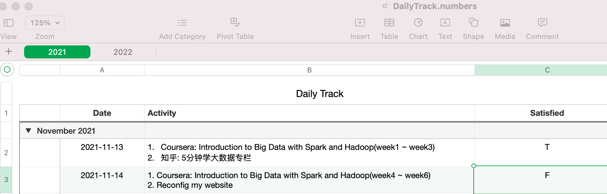

#  Normal Data Engineer

**Name**: 普通数据工程师养成计划。

**Language**: Chinese. 

**Archieve or Not**: No. (archieve means no more update)


## 01. Preface

>  **Main Target:** to be a Data Engineer without master degree learning experience.


最最前面的话：

1. 脱产
2. 一天保证14小时的精力
2. (我这样的口气只是因为我在使用“费曼学习法”):Concept 、Teach、Review 、Simplify

我的基本情况：

```text
这是我第三个GitHub账户(前两个已经注销)，也是最后一个('cuz领域确定)，我最开始是做Android驱动，后面面试P7失利后，借着熟人的关系做了项目经理，疫情2010年末退出一线城市，回到二线城市或者说(居住)压力没有那么大，并且仔细考虑自己开实体店 VS 做一名专业人士 VS MBA后，选择了成为一个数据玩家，从这条线再切换到...(keep it secret)
```

and `Why data engineer?`

```txt
因为我记得，多年前，我那些读研的同学要么人工智能，要么大数据；我想试试没有那个研究生经历能不能自己登堂入室(读研的话，我大概率还是读 MBA)
```


**本文(该folder)全部都是期间的笔记**(writen in Typora based on filesystem). **完整笔记**.

* 因为这个学习和训练期间的笔记，其实对于我没有太多了价值 (它不同于工作期间的 Handbook, Toolbox)
* 开箱即用
* 因为我不想写博客，本repo写完就会 Archieve
* 请用 Typora 打开本目录/repo


*不得不说一点，本记录其实是Round2，之前我已经对整个大数据领域有了一定的认识了, [Round 1](https://www.derekactions.com/post/23e8e883/#Round-1-Familiar-with-Off).*


**我并不是零基础，但如果零基础其实也可以按我的方式来**(只不过可能行进的慢一点？我猜的)。


(Rule: One task, One commit; Not Daily Commit)


<mark>下面步入正文</mark>.


## 02. Normal Require

基本要求：

1. 本科及以上学历(计算机，数学，统计)
2. 熟悉大数据技术栈 (HDFS、Kafka、Hive、HBase、Flink、Spark、Clickhouse)
3. 熟悉 Java/Scala语言，具有相关的开发经验
4. 熟悉 SQL，包括 Hadoop/Hive、Spark SQL相关经验
5. 对数据敏感，具备一定的数据分析能力


(来自某大券商的任职要求JD)


## 03. Tips from pioneer


前辈建议: 

* 最关键的hadoop、hive入手，熟练使用框架后跟着demo看源码会很有帮助

* 要是想找一份高薪的工作，就不仅要掌握如Hadoop全家桶之类的大数据处理框架的使用，还需要掌握底层的原理及其调优方法

* 现在金融、保险、证券类公司基本都是阿里云的框架，不需要这么多开源的……
  举个栗子：离线数据分析基本用的是 polardb，通过用数据集成（底层就是datax）到maxcomptue（也就是odps）。可以导入后用分区字段动态分区，也可以设置变量，跑T+1模式，然后就是ODS—DWD—DWS—DWT—ADS。聚合计算出结果后，使用quickbi或者datav出BI，这样一个简单技术选型，但是很实用，也不贵，一般CTO应该会同意的……
* 至于实时数据处理，直接读RDS的数据，用DTS读到datahub（等于是缓存吧），再用阿里云的实时计算（其实底层就是flink，阿里应该是收购了flink，自己重构了一个框架，叫做blink），聚合计算后，再存入RDS。至于是否采用RDS，或者采用其它阿里云的数据库，完成可以根据公司的并发情况去选择。

... (懂得自然懂，不懂的后面也会懂)


总之，用好，然后学习其原理，然后有机会接触大平台，再来举一反三。


## 04. Core

因为我有过Round1的知识储备，所以知道哪里是重点，从哪里入手，从哪里出来。

不会说，"东西太多啊，不知道哪里下手啊"之类的statement。


**指导思想**就一条：**抓住核心，然后遇到问题解决问题**。

**具体来说**: <mark>直接上手 Hadoop 框架/生态，然后期间遇到问题解决问题</mark>。

* 没懂？--- en, Hadoooooop 生态内的东西可不少！

(其他框架？如果玩熟悉了第一个，其他框架同理；至少且相比第一个框架熟悉起来更快)


## 05. Environment Explain


本地环境玩清楚了，再去玩云，而且一定要玩云，国际国内都要玩。

* 国际： AWS，GCP

* 国内：阿里云，腾讯云


## 06. Check Specification

验收标准：

* Have **有足够多的案例练手 (必须)**

* Can 考取国内外知名大企业的 DataEngineer Certificate

* Can 找一份符合市场薪资的大数据工程师工作


后两条，完成任何一条，基本可以证明已经具备从业能力。

*学通了，就具备**迁移能力**，所以考证 --- 学习新的平台的框架&架构，就能很好的证明*

*(云证书，它们一般用的自己的框架而非开源标准，所以也需要一定的时间去熟悉，应该不能上来就考吧？天才)*


## 07. Action List

> 指导思想：直接上手 Hadoop 框架/生态，然后期间遇到问题解决问题。然后其他框架同理。

上手的意思是：**一丝不苟的吃透**。

*(第一个不吃透，后面遇到问题就难办了，比如要你比较 Spark VS hadoop MapReduce，前面没有打牢基础，后面更加松松垮垮)*

Steps 其实不少！

我个人还算是个 `目标导向` *(功利心重，不见好处不出手)*，`雷厉风行`*(作息时间稍稍混乱)*的人，所以尽管看似步骤很多，**但是进度却不慢**，**也没有必要太慢**，只要不笨的话。

<mark>这些 step 的核心</mark>： 

Hadoop 和 Spark 吃透(80% -- 2/8原则)，其他流行框架，开源的或者不开源的则根据需要进行抽丝剥茧，比如 GCP(谷歌平台)，它上面就不是用的开源那一套，貌似腾讯云也是。

*(遇到再说)*

*(一个folder完成再开启另外一个folder)*

*(估计需要至少一个月，因为还要看框架的源码，虽然是挑着看)*


### Step 1: Start Small

请参考目录(folder/director, `step1`).

摘要：通过一本简短且权威的实战类书籍，彻底上手Hadoop。

[Folder HERE](/steps/step1)

### Step 2: Repeat Hadoop

请参考目录(folder/director, `step2`).

[Folder HERE](/steps/step1)

### Step 3: Again Repeat Hadoop

请参考目录(folder/director, `step2`).

[Folder HERE](/steps/step1)

### Step 4: Sorrry Again Repeat Hadoop

请参考目录(folder/director, `step3`).

[Folder HERE](/steps/step1)

### Step 5: Checkpoint:  Amend and Archieve

三遍的Hadoop；Hadoop基本没有问题了，这里要停一下；这里要确保拆解Hadoop这个框架的时候，周边的技术，需要的技术，比如linux系统，计算机网络，进程知识，涉及到的设计模式，相关语言(Java啊，C++啊，Python啊，SHELL啊)等等，在进入下一个大数据框架比如Flink的时候不会成为阻碍，使得你可以用上一个框架


### Step 6: TODO

[Folder HERE](/steps/step1)


## 08. Timeline

为什么记录时间？习惯了。




| 序号 | 所属阶段 |     时间(start)     |      时间(end)      | 主要事项                                                     | 补充说明                                                     |
| :--: | :------: | :-----------------: | :-----------------: | :----------------------------------------------------------- | ------------------------------------------------------------ |
| 001  |  Step1   | 2021-11-14 08:22:48 | 2021-11-15 00:10:48 | Setup Learning Framework<br />建立快速学习计划，构建模型框架. | Create Repo 'data-player' and Initiate.                      |
| 002  |  Step1   |                     |                     | Hands on <写给大忙人的Hadoop2>                               | 看两遍，所有案例完全跑通，期间涉及到的所有没有熟悉的技术记录下来，预留案底，直至Step5 一并解决。 |
| 003  |          |                     |                     |                                                              |                                                              |
| 004  |          |                     |                     |                                                              |                                                              |
| 005  |          |                     |                     |                                                              |                                                              |
| 006  |          |                     |                     |                                                              |                                                              |
| 007  |          |                     |                     |                                                              |                                                              |
| 008  |          |                     |                     |                                                              |                                                              |
| 009  |          |                     |                     |                                                              |                                                              |


## 09. Refs & Materials

被我刷过的书籍，教材，视频，DOC，评论等等，整理如下：


Ref:

*(排名即完成的时间顺序，我只会在一项材料弄完之后再换另外一个材料)*

* <写给大忙人的Hadoop 2> - 书籍


Ma:

*(因为长时间的投入注意力容易分散，需要补充血糖保持集中focus)*

* 2盒德芙香醇巧克力
* 一罐蜂蜜


## 10. Acknowledgement

中途咨询过的前辈，先驱，从业者，同行等:

*(排名不分先后)*

* 


## 11. Postfix

其一： (其实我最初写本文，除了费曼想学习法，或许本能的也是想测试一下自己的学习能力，同时监督一下自己在没有生存压力？的环境下，快速步入正轨)

\

其二：虽然可能这本记录给不了你太多帮助，虽然这里放的是 MIT License，但我还是希望对你有帮助或者你有用到它的时候，别忘记了提一下我 --- 尽管 Derek 只是个网名。(或者我的快速学习方法也能供你参考呢？说不准)


Will you a pleasant life.

See ya.

